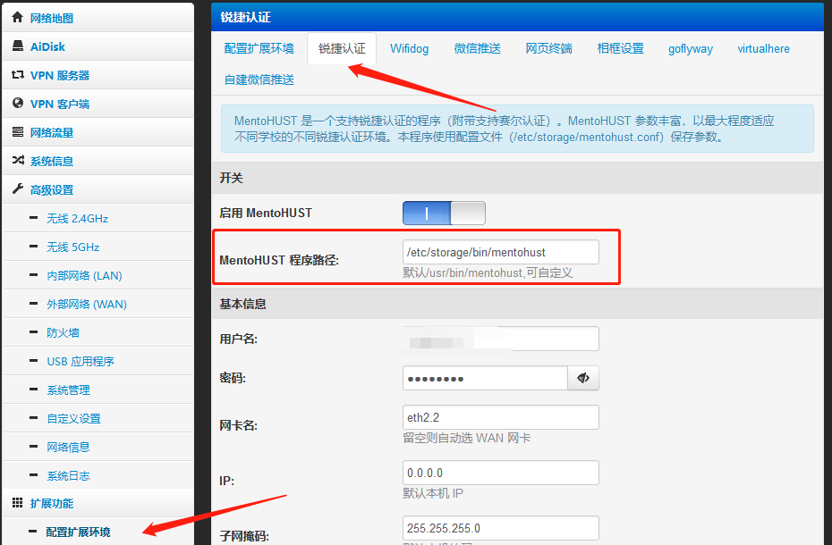

# 通过padavan连接GZHU校园网，并且IPv6可用

## 准备工作

1. 选购路由器
   - 请选择处理器为`MT7621`并且Padavan固件支持设备，否则无法进行接下来的操作；
   - `mentohust`并非自编译，不能确保其他处理器的机器能够使用
   - 尽量选择有5GHz频段WiFi的路由器，2.4Ghz干扰严重
   - 如果您需要刷入的是OpenWRT固件，本教程不适用，请移步各大搜索引擎或参考[此教程](https://hanriri.com/tech/SchoolRouter.html)选购路由器和编译MiniEAP；
2. 选择困难/不会选
   - 请选择小米mini（R1c）或者其他小米路由器，本文以小米mini（R1c）为例；

## 写入固件

1. 刷入breed（不死鸟）
   - 刷入Breed是为了之后可以方便更换固件，防止路由器变砖；
   - Breed下载地址：<https://breed.hackpascal.net/>
   - 方法因路由器而异，请在搜索引擎检索相应路由器的刷入方法；
   - 流程一般都是刷入特定版本的官方固件、获得开发者权限、通过SSH刷入breed；
   - 小米mini请参考[此教程](https://www.cnblogs.com/HGNET/p/14697980.html)，教程选择的是OpenWRT固件，输入固件选择我们下载好的padavan固件即可；
2. 下载固件
   - 在padavan的固件下载网址：<https://opt.cn2qq.com/padavan/>搜索你的路由器型号，内存大小也要对应
3. 进入breed
   - 在断电情况下，按住路由器的`reset`键并接通电源，使用`WAN`口连接电脑，浏览器访问`192.168.1.1`，此时应该能进入breed后台;
4. 刷入padavan固件
   - 在Breed后台选择固件更新，上传并写入刚才下载好的固件，使用`LAN`口连接路由器
   - 等待重启，直接进行下一步;
5. 进入padavan管理界面
   - padavan的默认管理地址为`192.168.123.1`，第一次启动请耐心等待
   - padavan的默认用户名`admin`，密码`admin`;

## 替换和配置mentohust

1. 前提
   - Padavan自带的`mentohust`不能连接GZHU的校园网，需要使用[此mentohust](/mentohust)
   - 请在以下每一步操作后，在网页底部应用本页面设置
2. 写入并保存
   - 进入padavan后台，选择系统管理->服务，打开SSH权限
   - 安装并使用`WinSCP`连接（如果你会使用命令行或其他方法完成以下操作，可以不用安装），将这里提供的`mentohust`复制到路由器的`/etc/storage/bin`目录下
   - 路由器每次重启都会删除未保存的更改，需要在系统管理->恢复/导出/上传设置，保存内容到闪存
   - 此处可以将路由器重启一次，如果`/etc/storage/bin/mentohust`没有消失，证明写入成功
3. 配置
   - 进入扩展环境->锐捷认证，将MentoHUST 程序路径修改为`/etc/storage/bin/mentohust`
   - 启用MentoHUST，填写校园网的`用户名`和`密码`，将组播地址修改为`锐捷`，DHCP方式修改为`认证后`，是否后台运行修改为`是，输出到文件`
4. 记得应用本页设置，此时应该可以正常使用了；

## 解决IPv6

1. 好处
   - 绝大部分区域已经支持IPv6，如果没有，请与网络中心联系；
   - 大部分移动应用已支持IPv6，比如微信和B站，不会断网；
   - 获得更多的BT连接，且比IPv4更快；
   - GZHU的IPv6流量上下对等100Mbps，比纯IPv4好得多；
2. 方法
   - 请参考[此教程](https://blog.csdn.net/weixin_45983575/article/details/116424756)或者直接根据以下方法进行设置
   - 进入系统管理->服务，启用napt66
   - 进入外部网络（WAN）->IPv6设置，请完全按照下图设置，IPv6内网地址为`dc00:101:101::1`

## Enjoy it

1. 测速
   - 请使用<https://test.ustc.edu.cn/>进行测速，可以对IPv4和IPv6进行对比
   - 如果IPv6测速页面打不开，请先检查电脑的IPv6是否已打开
2. Q&A
   - 无法上网！
   - 请检查mentohust是否写入成功，操作各步骤是否点击了页面底部的保存配置，请一再细细阅读教程
   - 我的IPv6速度没有100Mbps！
   - GZHU校园网是共享带宽，很多时候其实无法达到满速，请使用有线连接路由器，或只使用5GHz的WLAN，如果使用了2.4GHz，由于干扰问题，速度更没有保障
